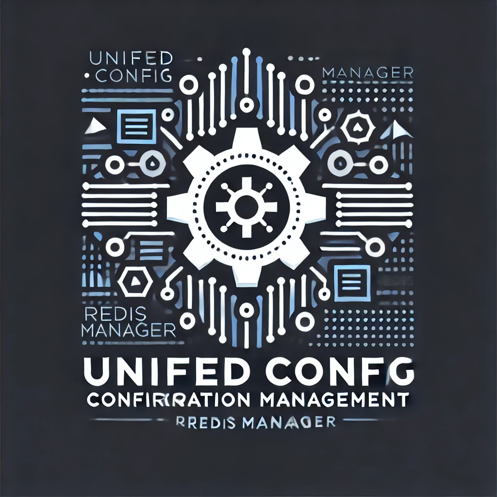
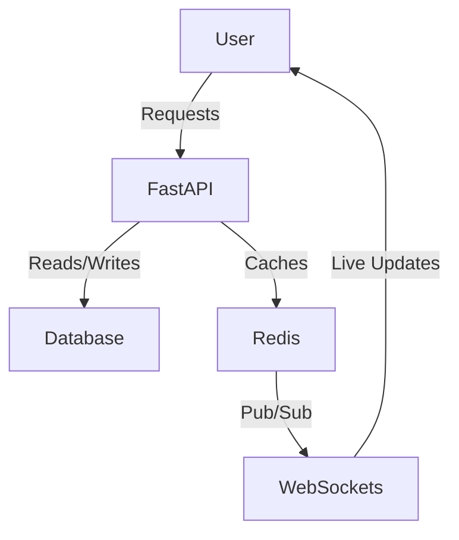
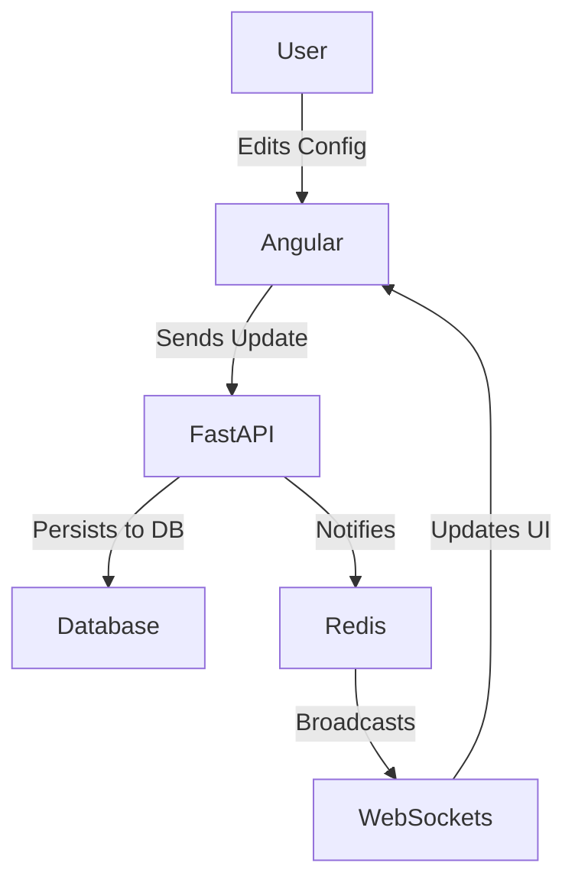

# **Unified Config**
[](https://pypi.org/project/unified-config/)  
[](https://pypi.org/project/unified-config/)  
[](https://pypi.org/project/unified-config/)  




## Overview
**Unified Config** is a **versatile configuration management system** designed for **microservices** and **distributed applications**. It provides a centralized and flexible way to manage configurations, leveraging **SQLAlchemy ORM for database interactions**, making it compatible with multiple database backends.

## Tutorial 🎥
[](https://www.youtube.com/watch?v=phOPqquUhA0)


## Features
- **Database-Backed Configuration Management** (SQLAlchemy ORM - supports various databases)
- **Redis Caching & Pub/Sub for Live Updates**
- **Support for Multiple Formats** (JSON, YAML, TOML)
- **Automatic Fallback to Input Files on First Setup**
- **Transaction-Safe Bulk Updates** with Atomicity
- **Real-Time Config Streaming with WebSockets**
- **Exponential Backoff Retry for Resilience**
- **Configuration Change History Tracking**
- **Makefile-Based Automation for Development & Deployment**

## Architecture
The Unified Config system is built on a **multi-layered approach**:
1. **Database (SQLAlchemy ORM)** - Stores configurations and tracks change history.
2. **Redis Cache** - Reduces DB queries and provides **Pub/Sub for real-time updates**.
3. **FastAPI REST API** - Exposes CRUD endpoints for managing configurations.
4. **WebSocket API** - Pushes **live configuration changes** to connected clients.
5. **Configuration File Loader** - Supports **YAML, JSON, and TOML** as input sources.
6. **Async Transaction Management** - Ensures **atomicity** and **consistency**.

### **Architecture Flow (Mermaid Diagram)**


## Installation
### 1️⃣ Clone the Repository
```sh
git clone https://github.com/yokha/unified-config.git
cd unified-config
```

### 2️⃣ Set Up Virtual Environment (Using Makefile)
```sh
make setup-venv
```

### 3️⃣ Install Dependencies (Poetry-Based)
```sh
make update-requirements
```

## Development
### Running Tests
```sh
make unit-test
make integration-test
```

### Linting & Code Formatting
```sh
make lint
make format
```

### **Makefile Commands**
#### **Unified Config Package**
```sh
make setup-venv  # Set up a virtual environment
make clean-venv  # Clean up the virtual environment
make migrate-upgrade  # Apply latest migrations
make migrate-history  # Show migration history
```

---

### **Example FastAPI Backend & Angular Frontend (Testbench)**
Unified Config includes **example applications** under `testbench/`, showcasing a **FastAPI backend** and **Angular frontend** for configuration management.

##### **Running Testbench Services**
```sh
cd testbench
make docker-up  # Start the example backend services using Docker Compose
make migrate-upgrade  # Apply migrations for the example FastAPI backend
make run  # Start the example FastAPI backend
```
- API documentation available at `http://localhost:8080/docs`.
##### **Access Frontend**
```sh
cd testbench/frontend
npm start # Open localhost:4200 in broswer
```
- Open `http://localhost:4200` for the **Angular frontend**.

###### **Frontend Pages & Navigation**
The Angular frontend provides a user interface for managing configurations.
- **Home Page**: Overview of configurations and real-time updates.
- **Config Editor**: Allows users to edit, add, and delete configuration values.
- **Live Updates**: Displays real-time configuration changes using WebSockets.
- **History View**: Shows audit logs of configuration changes.

### Example Flow



### Usage
#### Configuration Management API
##### **Get All Configurations**
```sh
curl -X GET http://localhost:8080/config/export?format=json
```

#### **Set a Configuration Value**
```sh
curl -X PUT http://localhost:8080/config/set -H "Content-Type: application/json" -d '{"section": "app", "key": "version", "value": "1.2.3"}'
```

#### **Delete a Configuration**
```sh
curl -X DELETE http://localhost:8080/config/delete?section=app&key=version
```

### WebSocket for Live Updates
To receive **real-time updates**, connect to the WebSocket endpoint:
```javascript
const socket = new WebSocket("ws://localhost:8080/config/updates");
socket.onmessage = (event) => {
  console.log("🔄 Live Config Update Received:", JSON.parse(event.data));
};
```

## Configuration Storage Behavior
- On first-time setup, **reads from an input file** (YAML/JSON/TOML) if the database is empty.
- Once populated, **DB becomes the source of truth** and is synced with Redis.
- Configurations can be retrieved from **Redis for performance** or **DB for persistence**.
- Change history is logged for **auditability**.
- Redis Pub/Sub notifies **WebSocket clients** of changes in real-time.


## Roadmap
### **Takeaways from Current Version**
This project serves as an opportunity to **explore and learn multiple frameworks**:
- **Python**: Advanced async handling, structured project organization.
- **SQLAlchemy + Alembic**: Database ORM, migrations, transactions, atomicity.
- **Redis**: Caching and Pub/Sub for real-time updates.
- **FastAPI**: Modern API framework, dependency injection, WebSocket streaming.
- **Angular**: Frontend integration for managing configurations.

### **Future Enhancements**
- ✅ **Current version**: Core functionality with **database storage, Redis caching, and WebSockets**.
- ⏳ **Upcoming:**
  - Need your feedback to evolve this version into something better. For me, it was about getting familiar with many frameworks. I have some ideas, but I’d love to hear from you!


## **Changelog**
Detailed changelog in [CHANGELOG.md](CHANGELOG.md).

---

## **License**
Licensed under the MIT License. See [LICENSE](LICENSE) file for more details.

---

## **Contributing**
We welcome contributions! Please see our [Contributing Guide](CONTRIBUTING.md) and [Code of Conduct](CODE_OF_CONDUCT.md) to get started.

---

**Initially Developed by [Youssef Khaya](https://www.linkedin.com/in/youssef-khaya-88a1a128)**

---
🚀 **Star this repo if you find it useful!** ⭐
